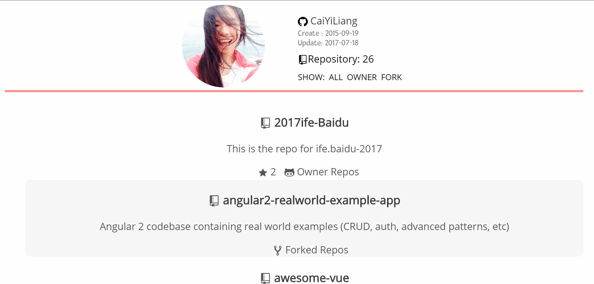

# Github Repos List

> 用React-Redux实现Github仓库列表<br>
> A simply webapp built with React + Redux + Redux-observable + flexbox + lodash.
<br>

# demo

<br>

## Build Setup

``` bash
# install dependencies
npm install

# serve with hot reload at localhost:8080
npm run start

# build for production with minification
npm run build
```
<br>

## todo item
- Extension: Add Input form to search other user's Github List
- Improve css styling
<br>